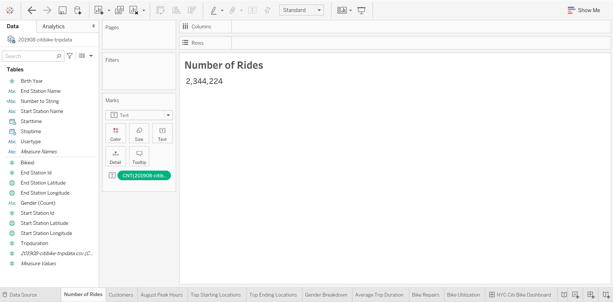
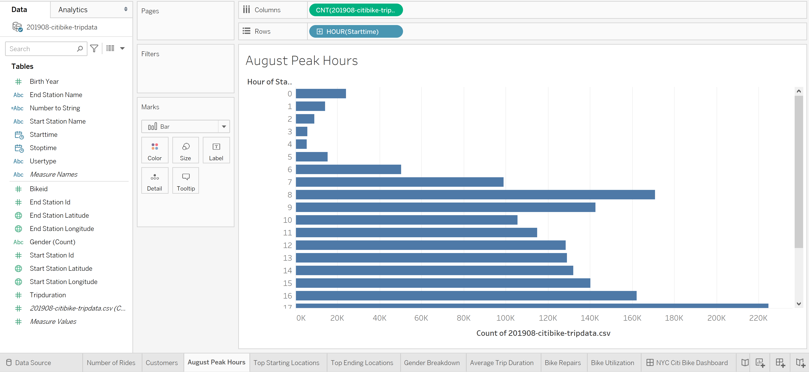
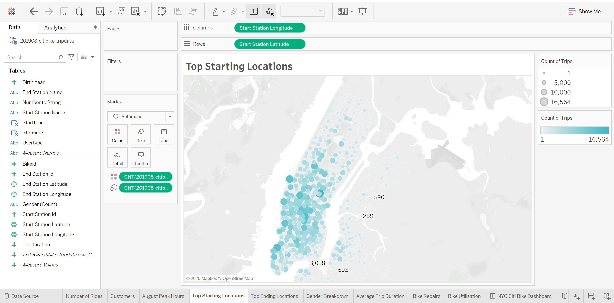
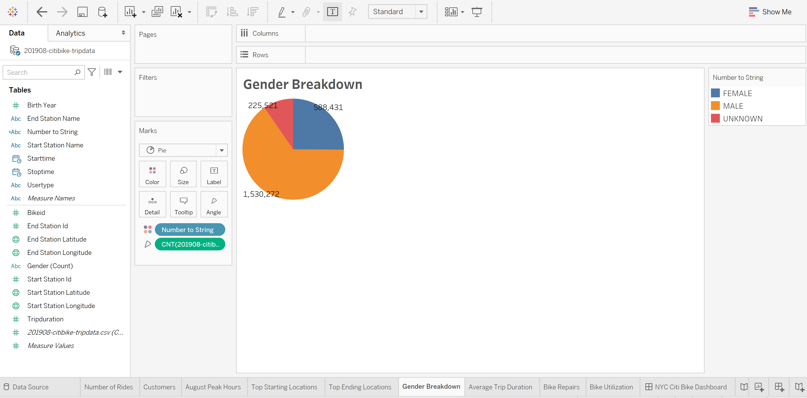
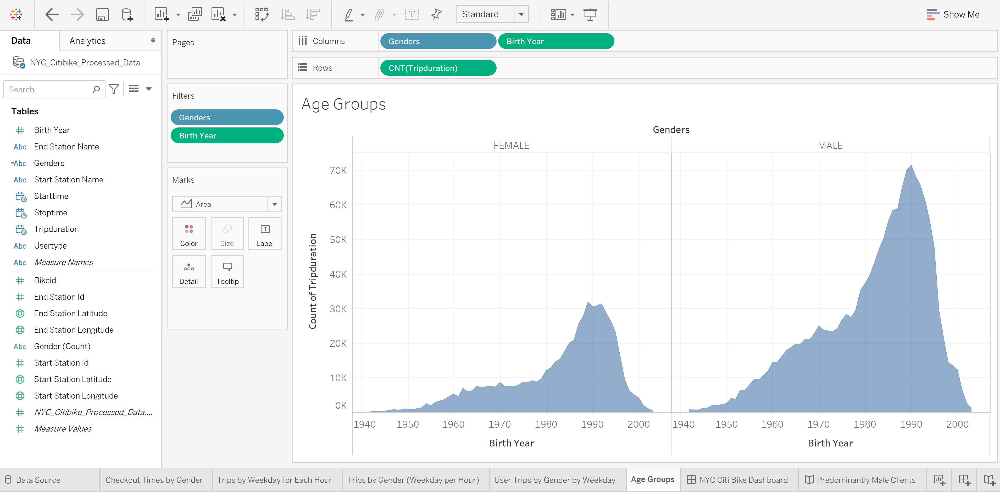

# NYC BikeSharing

> Breakdown of Citi Bike's rider data in New York City from August 2019 for insights in starting the same style of business in Iowa.


## Overview of Project

We now know the breakdown of rider types in New York City, which will help us predict the customer breakdown in Des Moines and, in turn, propose a business model to investors. We know this by the first round of analysis we did [BikeSharing](https://public.tableau.com/profile/jovani.pink#!/vizhome/BikeSharing_16039941514670/NYCCitiBikeDashboard?publish=yes) and then in our final analysis [NYC Citi Bike](https://public.tableau.com/profile/jovani.pink#!/vizhome/NYCCitibike_16041943647530/PredominantlyMaleClients?publish=yes).

## Folder Structure

```
src/
├── data
│ ├── external
│ ├── interim
│ ├── processed
│ │ └── NYC_Citibike_Processed_Data.csv
│ └── raw
│ └── 201908-citibike-tripdata.csv
├── reports
│ └── powerbi
│ └── nyc-citibike.pbix
├── resources
├── .gitignore
├── LICENSE.md
├── nyc-citibike.ipynb
└── README.md
```

## Summary

We pulled Citi Bike's data using Python and Pandas to verify the available download sources, data modified, and size. Once we've cleaned up the raw data we did further analysis and visualization in Tableau. We started asking questions of the data on understanding Citi Bike's business, questions that would gve us insights in test our idea of starting a business in Iowa and what information should we convey to investors.

### Resources

Data sources are CSV files provided by [Citi Bike](https://www.citibikenyc.com/system-data) that lead you to their [Citi Bike Data download page](https://s3.amazonaws.com/tripdata/index.html).

The CSV file below is the data set used in this project. They are from the webpage.

|               Name               |       Date Modified        |   Size    |   Type   |
| :------------------------------: | :------------------------: | :-------: | :------: |
| 201908-citibike-tripdata.csv.zip | Sep 18th 2019, 01:33:14 pm | 100.02 MB | ZIP file |

Analytic Visualization tool we used is Tableau Desktop: https://public.tableau.com/s/

## Results

The following questions were answered about the data using Tableau:

How many bike trips were recorded during the month of August?



We'll figure out the peak hours for bike trips during the month of August. This will help our investors get a ballpark estimate of how many bikes we might need in Des Moines. What Are Peak Riding Hours in the Month of August?



What are the highest-traffic locations? Understanding both when and where people use Citi Bike will help you plan your pilot in Des Moines.



What can the data tell us about the riders themselves? Often, the first place we start when understanding a population is gender.



While working with the data we found that the majority of clients were men.



## Analysis

## Todo Checklist

A helpful checklist to gauge how your README is coming on what I would like to finish:

- [ ] Fix and Update the styling of the Dashboards and Stories.
- [ ] Redo everything in Power BI.

## Contributing

Pull requests are welcome. For major changes, please open an issue first to discuss what you would like to change.

Please make sure to update tests as appropriate.

1. Fork this repository;
2. Create your branch: `git checkout -b my-new-feature`;
3. Commit your changes: `git commit -m 'Add some feature'`;
4. Push to the branch: `git push origin my-new-feature`.

**After your pull request is merged**, you can safely delete your branch.

## License

This project is licensed under the MIT License - see the [LICENSE.md](LICENSE.md) file for more information.
